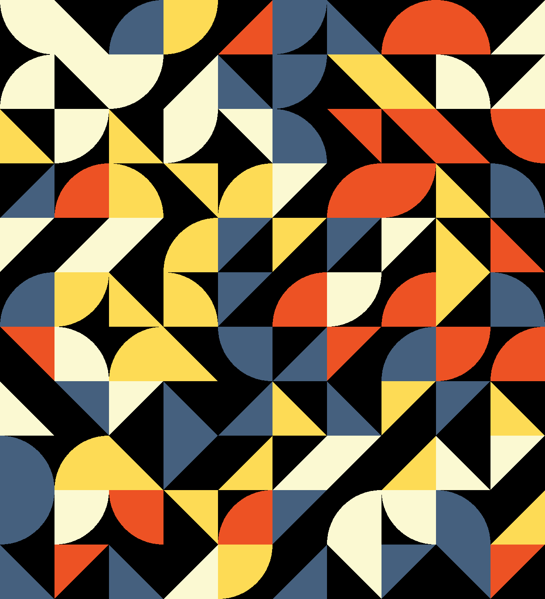

# quantmosaic - Quantum computer generated tiled living artwork



## What is quantmosaic?

Purpose of the project is to create a piece of art using IBM Quantum Computing tools. Artwork is a Mosaic that is generated based on changeable tileset and input data. The image elements are first arranged based on the quantum state that gets measured to create a controlled randomness. After initial creation, the art lives on as an animated gif that uses unstable quantum computer behaviour to glitch out.

## Usage

You can choose simulator or if you have time you can try generate data from real quantum computer.

`mosaic.ipynb` - real quants
`mosaic_sim.ipynb` - simulation

Run notebook in Qiskit (for example: lab.quantum-computing.ibm.com/). Don't forget to have a source tiles image, to start sample at `tiles/` is recommend.
You can also change parameters:
```
want_colors = 1 # from input 1 - color, 0 - black and white
seconds = 180 # length of generated gif in seconds
fps = 12 # frames per second (gif)
x = 100 # dimension of generated image ( # of tiles in x dimension)
y = 100 # dimension of generated image ( # of tiles in y dimension)
```
at the begining of notebook.


